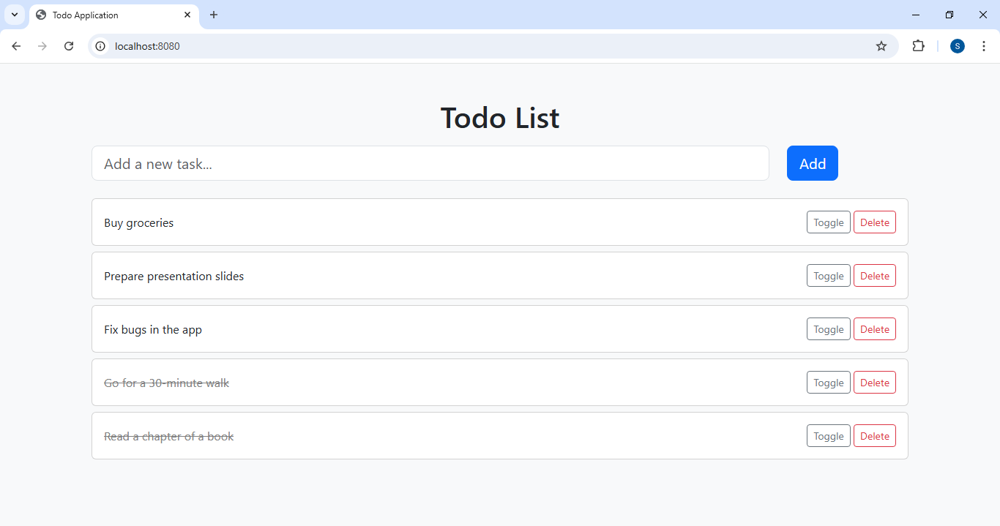

# TodoApp

A simple TODO application built with Spring Boot, Thymeleaf, and MySQL. Users can add, delete, and toggle tasks between completed and incomplete states.

---

## Technologies Used

- Java 17  
- Spring Boot  
- Thymeleaf  
- JPA (Hibernate)  
- MySQL  
- Lombok  
- Bootstrap 5  

---

## Installation

1. Clone this repository:  
   ```bash
   git clone https://github.com/sarim36/todoapp.git

2. Create a MySQL database named `todoapp`:

   ```sql
   CREATE DATABASE todoapp;
   ```

3. Open `src/main/resources/application.properties` and update your database credentials:

   ```properties
   spring.datasource.username=your_mysql_username
   spring.datasource.password=your_mysql_password
   ```

4. Build and run the application using your IDE or command line:

   ```bash
   ./mvnw spring-boot:run
   ```

   or

   ```bash
   mvn spring-boot:run
   ```

5. Open your browser and go to [http://localhost:8080](http://localhost:8080)

---

## Usage

* Use the input field to add new tasks.
* Click **Delete** to remove a task.
* Click **Toggle** to mark a task as completed or incomplete.

---

## Features

* Add new tasks
* Delete existing tasks
* Toggle tasks between complete/incomplete

---

## Screenshots



---

## Contributing

Contributions are welcome! Feel free to submit issues or pull requests.

---

## License

This project is licensed under the MIT License - see the [LICENSE](LICENSE) file for details.


